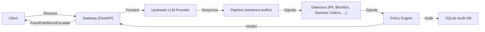
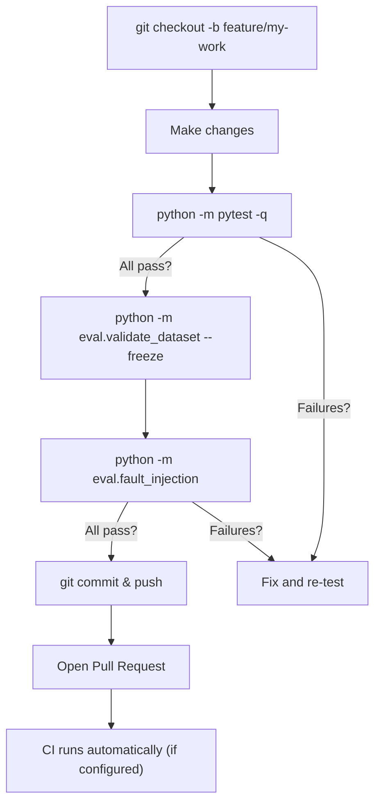

# ControlPlane.ai — Project Analysis & Testing Guide

## Project Overview

**ControlPlane.ai** is a reverse-proxy control plane that intercepts every LLM response and decides **Pass / Edit / Block / Escalate** based on per-use-case YAML policy configuration. Built for the Accenture Innovation Challenge 2026, Round 2.

### Architecture at a Glance



### Components

| Component | Path | Status | Description |
|---|---|---|---|
| **Gateway** | [`controlplane/gateway/`](file:///Users/lazybun/Development/controlplane-ai/controlplane/gateway) | Implemented | FastAPI app factory, SSE proxy, sentence buffer, ingress routing |
| **Detectors** | [`controlplane/detectors/`](file:///Users/lazybun/Development/controlplane-ai/controlplane/detectors) | 3 of 11 live | `tier1_pii`, `tier1_blocklist`, `numeric_claims` — 8 are stubs |
| **Policy Engine** | [`controlplane/policy/`](file:///Users/lazybun/Development/controlplane-ai/controlplane/policy) | Implemented | Schema validation, action resolution, per-use-case YAML |
| **Audit** | [`controlplane/audit/`](file:///Users/lazybun/Development/controlplane-ai/controlplane/audit) | Implemented | SQLite audit DB, append-only records, review queue |
| **Telemetry** | [`controlplane/telemetry/`](file:///Users/lazybun/Development/controlplane-ai/controlplane/telemetry) | Implemented | Metrics and spans |
| **Eval Harness** | [`eval/`](file:///Users/lazybun/Development/controlplane-ai/eval) | Partial | Dataset validation, run_all, fault injection, latency bench |
| **Dashboard** | [`dashboard/`](file:///Users/lazybun/Development/controlplane-ai/dashboard) | Stub | Streamlit app placeholder |
| **Demo** | [`demo/`](file:///Users/lazybun/Development/controlplane-ai/demo) | Stub | Demo script placeholder |

### Use-Case Policies (3 YAML files)

| Policy | File | Purpose |
|---|---|---|
| Finance Advisor | [`policies/finance_advisor.yaml`](file:///Users/lazybun/Development/controlplane-ai/policies/finance_advisor.yaml) | UC-1 |
| HR Copilot | [`policies/hr_copilot.yaml`](file:///Users/lazybun/Development/controlplane-ai/policies/hr_copilot.yaml) | UC-2 |
| Support Bot | [`policies/support_bot.yaml`](file:///Users/lazybun/Development/controlplane-ai/policies/support_bot.yaml) | UC-3 |

---

## Test Suite Inventory

The project has **22 test files** with **433 tests** (431 pass, 2 `xfail`). Here's what each covers:

| Test File | What It Tests |
|---|---|
| [`test_gateway_app.py`](file:///Users/lazybun/Development/controlplane-ai/tests/test_gateway_app.py) | Full gateway HTTP routes, both streaming and non-streaming paths |
| [`test_policy_engine.py`](file:///Users/lazybun/Development/controlplane-ai/tests/test_policy_engine.py) | Policy engine verdict resolution |
| [`test_policy_schema.py`](file:///Users/lazybun/Development/controlplane-ai/tests/test_policy_schema.py) | YAML policy schema validation |
| [`test_policy_store.py`](file:///Users/lazybun/Development/controlplane-ai/tests/test_policy_store.py) | Policy loading and store |
| [`test_policy_matrix.py`](file:///Users/lazybun/Development/controlplane-ai/tests/test_policy_matrix.py) | Confusion matrix + ADR mutation injection |
| [`test_tier1_detectors.py`](file:///Users/lazybun/Development/controlplane-ai/tests/test_tier1_detectors.py) | PII and blocklist regex detectors |
| [`test_numeric_claims.py`](file:///Users/lazybun/Development/controlplane-ai/tests/test_numeric_claims.py) | Numeric claims detection |
| [`test_detector_base.py`](file:///Users/lazybun/Development/controlplane-ai/tests/test_detector_base.py) | Detector base contracts (Signal, Stage, budgets) |
| [`test_audit_records.py`](file:///Users/lazybun/Development/controlplane-ai/tests/test_audit_records.py) | Audit record serialization, DB writes |
| [`test_review_queue.py`](file:///Users/lazybun/Development/controlplane-ai/tests/test_review_queue.py) | Escalation review queue |
| [`test_gateway_config.py`](file:///Users/lazybun/Development/controlplane-ai/tests/test_gateway_config.py) | Gateway YAML config loading |
| [`test_gateway_ingress.py`](file:///Users/lazybun/Development/controlplane-ai/tests/test_gateway_ingress.py) | Ingress routing and request parsing |
| [`test_sse_proxy.py`](file:///Users/lazybun/Development/controlplane-ai/tests/test_sse_proxy.py) | Server-Sent Events proxy and streaming |
| [`test_sentence_buffer.py`](file:///Users/lazybun/Development/controlplane-ai/tests/test_sentence_buffer.py) | Sentence boundary detection for streaming |
| [`test_canary.py`](file:///Users/lazybun/Development/controlplane-ai/tests/test_canary.py) | FR-GW-006 startup usage-sanity canary |
| [`test_telemetry.py`](file:///Users/lazybun/Development/controlplane-ai/tests/test_telemetry.py) | Metrics and spans |
| [`test_bench_latency.py`](file:///Users/lazybun/Development/controlplane-ai/tests/test_bench_latency.py) | Latency benchmarking harness |
| [`test_fault_injection.py`](file:///Users/lazybun/Development/controlplane-ai/tests/test_fault_injection.py) | Fault injection framework tests |
| [`test_run_all.py`](file:///Users/lazybun/Development/controlplane-ai/tests/test_run_all.py) | Eval harness integration |
| [`test_validate_dataset.py`](file:///Users/lazybun/Development/controlplane-ai/tests/test_validate_dataset.py) | Dataset consistency and freeze gate |
| [`test_span_less_single_source.py`](file:///Users/lazybun/Development/controlplane-ai/tests/test_span_less_single_source.py) | Span-less signal promotion (ADR-015) |
| `tests/review/` | Checkpoint adversarial tests + latency/keys review (2 `xfail` are documented limitations) |

---

## How to Test — Step by Step

### Tier 1: Local Unit Tests (Fastest, No API Keys Needed)

> [!IMPORTANT]
> Your local Python is **3.12.14**. The project specifies `>=3.11`, so you're good. The project was verified on 3.14 but 3.12 will work for all core tests.

```bash
cd /Users/lazybun/Development/controlplane-ai

# 1. Create virtual environment
python3 -m venv .venv

# 2. Activate it
source .venv/bin/activate

# 3. Install project + dev dependencies
pip install --upgrade pip
pip install -e ".[dev]"

# 4. Copy env template
cp .env.example .env

# 5. Run all 433 unit tests
python -m pytest -q
# Expected: 431 passed, 2 xfail
```

**What this covers**: All gateway logic, policy engine, detectors, audit DB, schema validation, sentence buffer, SSE proxy — all using mocks, no network calls needed.

---

### Tier 2: Eval Suite (Dataset Validation + Detector Scoring)

```bash
# Consistency gate — validates the 280-case eval dataset
python -m eval.validate_dataset

# Freeze gate — asserts dataset is byte-identical to the approved frozen state
python -m eval.validate_dataset --freeze

# Fault injection — tests fail-open / fail-closed behaviour (27 assertions)
python -m eval.fault_injection

# Full detector eval (scores 3 of 11 detectors against labelled corpus)
python -m eval.run_all
# → Generates: reports/eval_report.md
```

---

### Tier 3: Latency Benchmarks (Local, No API Keys)

```bash
# Measures gateway overhead, per-detector latency, sentence hold times
python -m eval.bench_latency
# → Generates: reports/latency_report.md
```

---

### Tier 4: Run the Gateway Locally (Needs an Upstream LLM)

> [!WARNING]
> The gateway is a **reverse proxy** — it needs an upstream LLM provider to forward requests to. Without one, it boots but can't serve completions.

```bash
# Edit .env with your API keys
# UPSTREAM_API_KEY=your-key-here       (for kiro-local)
# GROQ_API_KEY=your-groq-key-here     (for measured-class eval)

# Start the gateway (do NOT use port 8000 — that's the upstream)
uvicorn --factory controlplane.gateway.app:create_app --reload --port 8080

# Test with curl (once gateway is running):
curl -X POST http://localhost:8080/v1/chat/completions \
  -H "Content-Type: application/json" \
  -H "X-Use-Case: finance_advisor" \
  -d '{"model": "claude-haiku-4.5", "messages": [{"role": "user", "content": "Hello"}]}'
```

**Free upstream options** for testing:
- **Ollama** (local, free): Run `ollama serve` locally and point `base_url` to it
- **Groq free tier**: Sign up at [groq.com](https://groq.com) for a free API key with rate limits

---

## Free Cloud CI/CD Options

> [!TIP]
> The project has **no CI pipeline yet** (no `.github/workflows/`). Adding one would let every push and PR run the full test suite automatically.

### Option 1: GitHub Actions (Recommended — Free for public repos)

GitHub gives **2,000 free minutes/month** for private repos and **unlimited for public repos**. Here's a workflow you can add:

Create `.github/workflows/ci.yml`:

```yaml
name: CI

on:
  push:
    branches: [main]
  pull_request:
    branches: [main]

jobs:
  test:
    runs-on: ubuntu-latest
    strategy:
      matrix:
        python-version: ["3.11", "3.12", "3.13"]

    steps:
      - uses: actions/checkout@v4

      - name: Set up Python ${{ matrix.python-version }}
        uses: actions/setup-python@v5
        with:
          python-version: ${{ matrix.python-version }}

      - name: Install dependencies
        run: |
          python -m pip install --upgrade pip
          pip install -e ".[dev]"

      - name: Run unit tests
        run: python -m pytest -q

      - name: Validate dataset
        run: python -m eval.validate_dataset --freeze

      - name: Run fault injection
        run: python -m eval.fault_injection
```

### Option 2: Other Free Cloud CI Providers

| Provider | Free Tier | Notes |
|---|---|---|
| **GitHub Actions** | 2,000 min/month (private), unlimited (public) | Best integration with your existing GitHub repo |
| **GitLab CI** | 400 min/month | Good if you mirror to GitLab |
| **Render** | Free web service tier | Can host the FastAPI gateway for live testing |
| **Railway** | $5 free credit/month | One-click deploy for Python apps |
| **Fly.io** | 3 shared VMs free | Good for running the gateway as a service |

---

## Recommended Testing Workflow for a Collaborator



### Quick Command Cheatsheet

| What | Command |
|---|---|
| **Run all tests** | `python -m pytest -q` |
| **Run a single test file** | `python -m pytest tests/test_policy_engine.py -v` |
| **Run tests matching a name** | `python -m pytest -k "test_pii" -v` |
| **Validate dataset** | `python -m eval.validate_dataset --freeze` |
| **Fault injection** | `python -m eval.fault_injection` |
| **Full detector eval** | `python -m eval.run_all` |
| **Latency benchmark** | `python -m eval.bench_latency` |
| **Start gateway** | `uvicorn --factory controlplane.gateway.app:create_app --reload --port 8080` |

---

## Current Limitations to Be Aware Of

> [!CAUTION]
> - **8 of 11 detectors are stubs** (injection, toxicity, consistency, grounding, NER, cost, conversation, tier2_classifiers) — they exist as docstring placeholders only.
> - **Dashboard and Demo are stubs** — `dashboard/app.py` and `demo/run_script.py` are placeholders.
> - **`tier1_pii` recall is 0.8852** — below the 0.95 target. This is a documented standing limitation (SL-1 in `docs/08`).
> - The 2 `xfail` tests in `tests/review/` are **documented limitations** (Unicode homoglyph + zero-width email evasion), not pending fixes.

